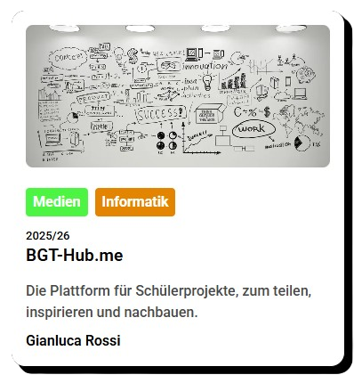

# 🌐 Project Hub

  

## 🚀 Das Projekt
Das BGT-Hub ist eine Web-App, welche es Schülern ermöglicht, ihre (Schul)projekte zu veröffnetlichen und so mit anderen zu teilen. Dadurch kriegt sowohl der Schüler eine Fläche, als auch das andere sich inspirieren können als auch das dies für die Schule als Werbemöglichkeit dienen kann. 

## 💻 Die Funktionen
- Landing-Page + Projektübersicht
- Loginsystem, Passwort-Reset, etc.
- Projektmaske mit der Möglichkeit, Text, Bilder, Videos & Links einzufügen
- Admin-Portal für Lehrkräfte zum freischalten von Artikeln und einladen von Alumnis
---
## ⚙️ Tech Stack

- **Frontend:** React + TypeScript + Vite  
- **Backend:** Express + Node.js + PostgreSQL  
- **Server** Nginx + Ngrok + PM2
---
##  Hinweis

Das Projekt ist privat entwickelt und als Projektarbeit an der BBS-ME finalisiert wurden. Zum jetzigen Zeitpunkt ist veröffentlichung in Klärung. 

